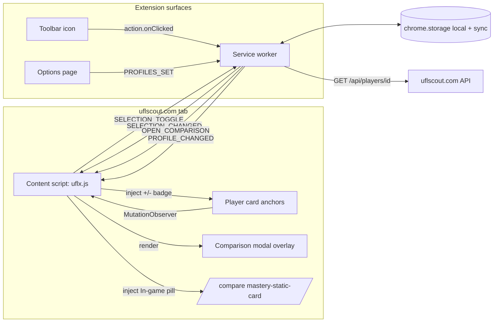

# Requirements

### Overview & Goals

Build a **Chrome Extension (Manifest V3)** that augments `https://uflscout.com/` with player-comparison tooling the site itself does not offer: a persistent multi-player selection list, sorting/filtering by the **sum of the user-relevant stats** (not just overall rating), and reusable **position-based stat profiles** (e.g., a CB profile ignores finishing / freeKicks / penalties).

The extension enhances — not replaces — the site. It reuses the site's own images, promo colours, playstyle icons and card renders wherever possible, so the UI stays visually consistent with UFL Scout.

### Scope

#### In Scope (MVP)

- **Card decoration**: on every rendered player card anchor (`a[href^="/players/"]`) anywhere on uflscout.com, inject a small **`+` / `−` toggle** to add/remove the player from the *Selection List*.
- **Toolbar action → comparison modal**: clicking the extension icon opens the *Comparison Modal* directly on the active uflscout.com tab. No popup, no intermediate selection list.
- **Comparison Modal**: near-full-screen in-site overlay injected by the content script. Sortable/filterable table of the currently-selected players. Includes two dedicated aggregate columns:
  - **In-game stats** — the sum of *every* numeric stat exposed by `/api/players/{id}`.
  - **Custom stats** — the sum of stats belonging to the currently *active* Stat Profile.
  Each row also carries its own `−` toggle so the user can remove a player without leaving the modal.
- **Stat profiles**: user-editable named profiles (e.g. `CB`, `CM`, `ST`) each being a subset of stat keys. The *Custom stats* column always reflects the active profile.
- **Defaults**: ship sensible seed profiles for CB, FB, CM, CDM, CAM, W, ST, GK so the tool is useful the moment it's installed.
- **Compare-page enhancement**: on `https://uflscout.com/compare?p1=…&p2=…&p3=…`, decorate every `div.mastery-static-card` with a small pill showing the player's **In-game stats** total (data pulled from the shared player cache; fetched on demand if missing).
- **Options page**: create, rename, edit, delete stat profiles; pick the *active* profile.

#### Out of Scope (deferred)

- **In-place `/db` page resort** — dropped per KD-4: the `/db` list rarely overlaps with the user's shortlist, so all sorting/filtering will live in the Comparison Modal.
- **Compare-page deep-link button** on player cards that pre-fills up to three selected players into `/compare?p1=…&p2=…&p3=…`. Data-layer is ready for it; UI is deferred.
- **Weighted stat profiles** (per-stat weights, not just set inclusion) — MVP uses unweighted sums.
- **Cross-device sync of the *Selection List*** (kept local; only *profiles* sync).
- **Any write requests to uflscout.com** — the extension is read-only against the site's public API.
- **Player-vs-player radar chart / diff visualisations**.

### User Stories

1. **As a UFL squad-builder**, I want to see a `+` badge on every player card so I can flag candidates as I browse.
2. **As a UFL squad-builder**, I want a single click on the extension icon to open a big, sortable comparison table of everyone I've flagged.
3. **As a UFL squad-builder**, I want to sort my shortlist by the **In-game stats** total (sum of all numeric stats), not just by overall rating.
4. **As a CB-hunter**, I want to activate a `CB` stat profile so the **Custom stats** column sums only the stats that matter for centre-backs, and I can sort the modal by it.
5. **As a UFL squad-builder**, I want to remove players from my shortlist directly inside the modal (via each row's `−` button) without closing it.
6. **As a returning user**, I want my selection list and profiles to persist across sessions, and my profiles to sync across devices.
7. **As a user browsing the site's `/compare` page**, I want to see each compared player's **In-game stats** total right on their card so I don't have to leave the page.

### Functional Requirements

- **FR-1 — Card detection**: the extension identifies player cards by any anchor whose `href` starts with `/players/{id}/` and extracts the numeric id. This works for search results, browse pages, and any future page that renders cards the same way.
- **FR-2 — Toggle button**: injects a `+` badge into each detected card. When the player is in the selection list, the badge shows `−` instead. Clicking toggles the state, updates storage, and updates the badge everywhere immediately.
- **FR-3 — Selection list persistence**: kept in `chrome.storage.local` under key `selectionList` (array of `{ id, addedAt }`).
- **FR-4 — Stat-data acquisition**: `/api/players/search` does NOT include per-stat values; only `/api/players/{id}` does. On first add, the extension fetches `/api/players/{id}`, caches the response in `chrome.storage.local` under `playerCache[id]` with a TTL (e.g. 14 days).
- **FR-5 — Action click**: clicking the extension icon fires `chrome.action.onClicked` and sends `OPEN_COMPARISON` to the active uflscout.com tab. If the active tab is not on uflscout.com, the service worker opens `https://uflscout.com/` and injects/opens the modal once the content script boots. There is no popup UI.
- **FR-6 — Comparison modal**: a near-full-screen overlay (≥ 92% viewport width / 90% height) with the columns:
  `Toggle (−) | Player | Rating | Position | Promo | <every discovered stat key> | In-game stats | Custom stats`.
  - Every header cell is click-sortable (asc/desc, tri-state back to default). Default sort = *In-game stats* desc.
  - **In-game stats** = sum of every numeric field in the player's stat dictionary; auto-discovered so we don't hard-code the list.
  - **Custom stats** = sum of the currently active profile's `statKeys`; recomputes live when the user changes the active profile via a dropdown inside the modal header.
  - Filter row for `position`, `promo`, `mastery` (multi-select chips).
  - Per-row `−` button calls `SELECTION_TOGGLE` and the row disappears (no page reload).
  - Close on Esc, backdrop click, or route change.
- **FR-7 — Stat profiles**: stored in `chrome.storage.sync` as `profiles: Record<string, Profile>` and `activeProfileId: string`. Broadcast `PROFILE_CHANGED` to every uflscout.com tab on activation.
- **FR-8 — Options page**: full CRUD over profiles, a checkbox grid of every discovered stat key, an active-profile picker, and a *reset defaults* button.
- **FR-9 — Compare-page decoration**: on `location.pathname === '/compare'`, parse `p1`, `p2`, `p3` from `location.search`, request each player via the shared cache, and inject a small pill (`.uflx-compare-ingame`) inside every matching `div.mastery-static-card` showing the *In-game stats* total. Redecorate on SPA route change and on `SELECTION_CHANGED` (in case the same players are toggled).

### Non-Functional Requirements

- **Compatibility**: Chrome 120+ (MV3 with promise-returning `chrome.*` APIs).
- **Performance**: DOM decoration must not stall the page — MutationObserver batching, `requestAnimationFrame`, and per-node idempotence (no double-decoration).
- **Politeness to the site**: cache aggressively; never fetch a player's `/api/players/{id}` more than once per TTL window; no bulk scraping of the entire DB.
- **Privacy**: no data leaves the browser. No analytics, no third-party requests. Only host = `uflscout.com`.
- **Robustness**: the site is an SPA — content script must survive client-side navigations (re-run detection on `history.pushState`/`popstate`, or via observing new nodes).

# Technical Design

### Current Implementation

Greenfield project. Only `.junie/` and `.agents/` configuration folders exist. No manifest, no source, no build tooling.

Target site is an SPA. Signals gathered from the issue description:

- Tailwind utility classes with the `scout-*` design tokens (`text-scout-text`, `bg-scout-*`, etc.).
- Search-results LI contains: card image (`https://cdn.uflscout.com/static-cards/{id}-{hash}.png`), name, promo pill, nationality flag, league icon, and a colour-coded rating number.
- **Anchor pattern**: every player card is an `<a href="/players/{id}/{slug}/…">`. This is the single most reliable selector for the extension.
- **APIs observed**:
  - `GET /api/players/search?search=<q>&limit=<n>` — typeahead search, returns limited card metadata **without stat numerics**.
  - `GET /api/players/{id}` — full player info (assumed to contain per-stat values like `stamina`, `shooting`, `speed`, `acceleration`, `curve`, `finishing`, `freeKicks`, `penalties`, …). The exact stat-key list needs a live probe once the extension is loaded — see *Risks*.
  - `/db?minRating=94` — HTML DB page with a stats table (headers `Player | Tier | RATING | HEIGHT | PAC/DIV | SHO/HAN | PAS/KIC | DRB/REF | DEF/SPE | FIT/POS`).

### Key Decisions (locked in)

> Recorded from the brainstorm round. Each line is the final decision.

#### KD-1 (locked): Comparison view = near-full-screen in-site modal

- Content-script-injected overlay (`<div id="uflx-modal-root">`) at ≥ 92% viewport width / 90% viewport height, backdropped over the page.
- Table columns are the entire deliverable: `Toggle | Player | Rating | Position | Promo | <every stat key> | In-game stats | Custom stats`.
- **In-game stats** column = sum of every numeric field in the player's stat dict (auto-discovered — no hard-coded list).
- **Custom stats** column = sum of the *active* profile's `statKeys`; changes live if the user switches profile from a dropdown baked into the modal header.
- Both aggregate columns are click-sortable; default sort = *In-game stats* desc.
- Per-row `−` toggle removes the player from the selection (the modal is the selection UI).

#### KD-2 (locked): Lazy fetch `/api/players/{id}` + cache in `chrome.storage.local`

- Fetch on first add and on demand when the compare / comparison-modal / options code needs stats.
- Bounded LRU (~500 entries, 14-day TTL) in `chrome.storage.local.playerCache`.
- Service-worker in-flight de-dup map prevents parallel fetches for the same id.

#### KD-3 (locked): `MutationObserver` on `a[href^="/players/"]:not([data-uflx-decorated])`

- rAF-batched decoration (skill rule #6), idempotent via `data-uflx-decorated="1"`.
- SPA route churn handled via `chrome.webNavigation.onHistoryStateUpdated` → `RESCAN` ping to the tab.

#### KD-4 (dropped): No in-place `/db` page resort

- Rationale (user): `/db` lists players the user has not necessarily flagged; sorting it doesn't advance the workflow. All sorting/filtering lives in the Comparison Modal.
- Consequence: no `content/dbPageResorter.js`. Reader stats extraction from `/db` DOM is also deleted.

#### KD-5 (locked): Storage layout

 Data | Area | Key(s) | Notes |
---|---|---|---|
 Selection list | `chrome.storage.local` | `selectionList` | Array of `{ id, addedAt }`. |
 Player cache | `chrome.storage.local` | `playerCache` | LRU-capped map of `id → CachedPlayer`. |
 Stat profiles | `chrome.storage.sync` | `profiles`, `activeProfileId` | Small; syncs across devices. |
 Ephemeral UI | in-memory | — | Modal open state, last-sorted column. |

#### KD-6 (locked): Toolbar icon = direct-action, no popup

- Manifest declares `"action": {}` (no `default_popup`).
- Service worker registers `chrome.action.onClicked`:
  - Active tab is on uflscout.com → `chrome.tabs.sendMessage(tabId, { type: 'OPEN_COMPARISON' })`.
  - Active tab isn't → `chrome.tabs.create({ url: 'https://uflscout.com/' })`, then send `OPEN_COMPARISON` once the content script signals `READY`.
- Rationale: KD-6 answer — since every player card already has `+/−` toggles and the modal shows the shortlist with its own `−` toggles, there is nothing left for a popup list to add.

#### KD-7 (new): Compare-page enhancement is a thin content-script decorator

- On `/compare*` pages, parse `p1`, `p2`, `p3` from the query string, hit `PlayerDataService.getPlayer(id)` for each, and inject a `.uflx-compare-ingame` pill inside every matching `div.mastery-static-card`.
- Reuses exactly the same data layer as the modal — zero new plumbing.

#### KD-8 (new): No build tooling — plain JS files loaded directly

- **MVP ships as raw, hand-authored files.** No bundler, no transpiler, no npm build step. This keeps the extension loadable directly via `chrome://extensions → Load unpacked`.
- **Consequence for content scripts**: statically-declared `content_scripts.js` files run as *classic scripts* in the same isolated world, in declaration order. They cannot use ES-module `import`. All content-script files share a single global namespace `globalThis.uflx.*` (see *Module Loading Strategy* below).
- **Consequence for the service worker**: registered as `"type": "module"` so it *can* use standard `import` statements to load `background/*.js` (`playerDataService.js`, `selectionService.js`, `profilesService.js`, `actionRouter.js`). These modules stay SW-only.
- **Consequence for shared code (`statMath`)**: written as a *classic script* that attaches its API to `globalThis.uflx.statMath`. Loaded in content-script order and via a plain `<script src>` in the options page — never as an ES module.
- **Consequence for icons**: MVP omits the `"icons"` field entirely (skill rule #1). Chrome renders its default puzzle-piece icon. Real PNGs are a follow-up before Chrome Web Store submission.
- A build step (esbuild) becomes worthwhile only if we later want TypeScript, code-splitting, or a UI framework. Explicitly out of scope for now.

### Module Loading Strategy

Because we ship raw files, load-order and namespacing must be pinned down before implementation:

1. **Content-script load order** (declared exactly like this in `manifest.json`):
   ```json
   "content_scripts": [{
     "matches": ["https://uflscout.com/*"],
     "js": [
       "shared/uflxNamespace.js",
       "shared/statMath.js",
       "shared/messages.js",
       "shared/storageKeys.js",
       "content/cardDecorator.js",
       "content/comparisonModal.js",
       "content/comparePageDecorator.js",
       "content/uflx.js"
     ],
     "css": ["content/uflx.css"],
     "run_at": "document_idle"
   }]
   ```
2. **Namespace bootstrap** — `shared/uflxNamespace.js` runs first and does exactly one thing:
   ```js
   globalThis.uflx = globalThis.uflx || {};
   ```
3. Every other classic script attaches its exports onto `globalThis.uflx.*`:
   ```js
   // shared/statMath.js
   (function (root) {
     root.statMath = {
       inGameSum(player) { /* ... */ },
       profileSum(player, statKeys) { /* ... */ },
       discoverStatKeys(player) { /* ... */ },
       sortByColumn(rows, key, dir) { /* ... */ },
     };
   })(globalThis.uflx);
   ```
4. `content/uflx.js` is the entrypoint — it runs *last*, wires listeners, and calls `uflx.cardDecorator.start()`, `uflx.comparisonModal.init()`, and `uflx.comparePageDecorator.start()` (each guards its own path/DOM preconditions).
5. **Options page** (`options/options.html`) loads the same shared scripts via **plain, non-module** `<script src="..."></script>` tags in the same order (`uflxNamespace.js`, `statMath.js`, `messages.js`, `storageKeys.js`, then `options.js`). No inline scripts, no inline handlers — CSP compliant.
6. **Service worker** (`background/sw.js`) is `"type": "module"`. It uses ordinary `import` statements to load `playerDataService.js`, `selectionService.js`, `profilesService.js`, `actionRouter.js`. It does **not** consume `shared/statMath.js`; the SW stores raw `/api/players/{id}` JSON and never computes sums.
7. Message-type constants (`shared/messages.js`) and storage keys (`shared/storageKeys.js`) also follow the classic-script + `globalThis.uflx.*` pattern. The service worker defines its own copies in a dedicated `background/messages.js` ES module (kept in sync with the shared ones; a tiny duplication we accept in exchange for no build step).

### Proposed Changes

**New extension** with three runtime surfaces:

1. **Content script** (`content/uflx.js` + `content/uflx.css`), matched on `https://uflscout.com/*`.
   - Detects player-card anchors (`CardDecorator`), injects the `+ / −` toggle.
   - Hosts the injected *Comparison Modal* (`ComparisonModal`).
   - Decorates the `/compare` page's `div.mastery-static-card` nodes with the *In-game stats* pill (`ComparePageDecorator`).
   - Communicates with the service worker via `chrome.runtime.sendMessage` for selection reads/writes and stat fetches.
2. **Service worker** (`background/sw.js`) — the data layer.
   - Owns storage reads/writes, the `/api/players/{id}` fetch queue, per-player cache TTL logic, LRU eviction.
   - Handles `chrome.action.onClicked` → routes `OPEN_COMPARISON` to the correct uflscout.com tab (opening one if needed).
   - Broadcasts `SELECTION_CHANGED` / `PROFILE_CHANGED` to every uflscout.com tab so decorations stay in sync.
3. **Options page** (`options/options.html`) — profile CRUD and active-profile picker. No popup page ships. Loads `shared/*.js` via classic `<script src>` tags (not modules) so it consumes the exact same code the content script does.

### Data Models / Contracts

```ts
// chrome.storage.local
type SelectionEntry = { id: number; addedAt: number };
type SelectionList = SelectionEntry[]; // key: 'selectionList'

type CachedPlayer = {
  fetchedAt: number;      // ms epoch
  data: PlayerFullInfo;   // raw /api/players/{id} response
};
type PlayerCache = Record<number, CachedPlayer>; // key: 'playerCache'

// chrome.storage.sync
type StatKey = string;   // e.g. 'stamina', 'shooting', 'finishing', ...
type Profile = {
  id: string;            // uuid or slug like 'cb', 'st'
  name: string;          // 'Center Back'
  statKeys: StatKey[];   // stats included in the sum
  isDefault?: boolean;   // seeded, not user-created
};
type ProfilesState = { profiles: Record<string, Profile>; activeProfileId: string };
```

**Message protocol (content ↔ service worker)**:

```ts
// Selection
{ type: 'SELECTION_GET' }                                → { list: SelectionList }
{ type: 'SELECTION_TOGGLE', playerId: number }           → { inList: boolean }
{ type: 'SELECTION_CLEAR' }                              → { ok: true }

// Player data
{ type: 'PLAYER_GET', playerId: number }                 → { player: PlayerFullInfo }
{ type: 'PLAYERS_GET_MANY', playerIds: number[] }        → { players: PlayerFullInfo[] }

// Profiles
{ type: 'PROFILES_GET' }                                 → ProfilesState

// Broadcast (service worker → all uflscout.com tabs)
{ type: 'SELECTION_CHANGED', list: SelectionList }
{ type: 'PROFILE_CHANGED', activeProfileId: string }
```

### Components

- **`CardDecorator`** (content script) — the MutationObserver + toggle-badge injector. Namespaced CSS class `uflx-toggle`, marker attribute `data-uflx-decorated="1"`.
- **`ComparisonModal`** (content script) — near-full-screen overlay `<div id="uflx-modal-root">` inserted at the end of `<body>`. Reuses site tokens (`bg-scout-*`) where visible and scoped `.uflx-modal-*` classes elsewhere. Sortable table with the two aggregate columns (*In-game stats*, *Custom stats*), filter chips, active-profile dropdown, per-row `−` remove.
- **`ComparePageDecorator`** (content script, `location.pathname === '/compare'` only) — reads `p1`, `p2`, `p3` from the query string, resolves each via `PlayerDataService`, and injects a `.uflx-compare-ingame` pill inside every matching `div.mastery-static-card` under the card image. Reruns on SPA nav + `SELECTION_CHANGED`.
- **`ProfilesEditor`** (`options/`) — profile CRUD form, seeds defaults on first install, active-profile picker.
- **`PlayerDataService`** (service worker) — fetch queue with de-dup + TTL + LRU: `getPlayer(id)`, `warmMany(ids)`, `evictOldest()`.
- **`SelectionService`** (service worker) — thin wrapper over `chrome.storage.local` with a `broadcast()` to open uflscout.com tabs.
- **`ActionRouter`** (service worker) — `chrome.action.onClicked` handler that resolves the target uflscout.com tab (or creates one) and dispatches `OPEN_COMPARISON`.
- **`statMath`** (shared module) — `inGameSum(player)`, `profileSum(player, statKeys)`, `discoverStatKeys(player)`, `sortByColumn(rows, key, dir)`. Used by both content script and options page.

### File Structure

```
/manifest.json
/background/
  sw.js                 # ES module — boot, onInstalled, onClicked, message router
  playerDataService.js  # ES module — fetch queue + cache + LRU + TTL
  selectionService.js   # ES module — selection CRUD + broadcast
  profilesService.js    # ES module — profile CRUD + broadcast
  actionRouter.js       # ES module — chrome.action.onClicked → OPEN_COMPARISON
  messages.js           # ES module — mirror of shared/messages.js (SW copy)
  storageKeys.js        # ES module — mirror of shared/storageKeys.js (SW copy)
/content/
  uflx.js               # classic script entrypoint — boots CardDecorator, Modal, ComparePageDecorator
  uflx.css              # scoped .uflx-* styles
  cardDecorator.js      # classic script — attaches to globalThis.uflx.cardDecorator
  comparisonModal.js    # classic script — attaches to globalThis.uflx.comparisonModal
  comparePageDecorator.js # classic script — attaches to globalThis.uflx.comparePageDecorator
/options/
  options.html          # loads shared/*.js via plain <script src>, no modules, no inline JS
  options.js            # classic script — no inline handlers (CSP)
  options.css
/shared/
  uflxNamespace.js      # classic script — creates globalThis.uflx = {}
  statMath.js           # classic script — inGameSum, profileSum, discoverStatKeys, sortByColumn
  storageKeys.js        # classic script — SELECTION_LIST, PLAYER_CACHE, PROFILES, ACTIVE_PROFILE_ID
  defaultProfiles.js    # classic script — seeded CB / FB / CM / CDM / CAM / W / ST / GK
  messages.js           # classic script — message-type constants
/icons/                 # empty in MVP — manifest omits the "icons" field per skill rule #1
CHROMEWEBSTORE.md       # created only if publishing is requested later
```

### Architecture Diagram



### Risks

- **Unknown stat-key list**: the exact JSON shape of `/api/players/{id}` is not in hand. First implementation task is a live probe (via Chrome DevTools for agents) to snapshot one response and derive `StatKey[]`. `statMath.discoverStatKeys()` walks the object shape at runtime so the modal + options grid adapt automatically.
- **In-game stats totals need consistent keys across players**: if some cards omit a stat (e.g. GKs vs outfield), sums stay comparable only when we sum by the *union* of keys with missing-as-zero. Documented in `statMath.inGameSum` semantics.
- **SPA route churn**: after a client-side navigation, the previously-decorated DOM may unmount. MutationObserver + `chrome.webNavigation.onHistoryStateUpdated` mitigates.
- **CSS bleeding into the site**: all injected CSS lives under `.uflx-*` classes and, for the modal, under `#uflx-modal-root`. No global selectors.
- **Fetch de-duplication is best-effort only**: the service worker's in-flight `Map` is an in-memory optimisation and is lost if the SW terminates between rapid toggles (skill rule #7). This is acceptable because `chrome.storage.local.playerCache` is the persistent source of truth — a duplicate fetch after SW restart just overwrites the same cache entry.
- **Storage growth**: `playerCache` needs an LRU cap (e.g. 500 entries) to stay well under the 10 MB local quota.
- **Compare-page card selection**: `div.mastery-static-card` may match cards in tooltips or previews, not just the three top-level compare slots. `ComparePageDecorator` pairs each `p{n}` id with the *n-th* top-level card in DOM order to avoid double-decorating.
- **Site DOM changes**: the `href^="/players/"` selector is semantic and unlikely to change, but the injection point (where the badge sits) may. Content script uses a safe fallback: if the preferred host element isn't found, prepend the badge to the anchor itself.
- **Icon assets** (skill rule #1): MVP omits the `"icons"` field entirely so Chrome shows its default puzzle-piece icon. Adding real 16/48/128 PNGs is a pre-publish task, not an MVP blocker.
- **Shared code duplication in the SW**: `background/messages.js` and `background/storageKeys.js` mirror their `shared/` counterparts because content scripts can't consume ES modules. Constants drift is prevented by keeping both under version control and reviewing them together in every change that touches them (documented in the repo's `README.md` when the code is written).
- **CSP in extension pages**: `options.html` (and any future extension page) cannot use inline `<script>` blocks or inline event handlers (`onclick`, etc.). All JS lives in external files and wires listeners via `addEventListener`.

# Testing

### Validation Approach

With **Chrome DevTools for agents** available, validation is interactive: load the unpacked extension, open `https://uflscout.com/`, and drive real flows while inspecting DOM, storage, and network.

### Key Scenarios

1. **Card detection & idempotence**
   - Load `https://uflscout.com/`, type `valverde` in the site's search box → 8 result LIs appear, each with a `+` badge and no duplicate badges after repeated searches.
   - Every card exposes `[data-uflx-decorated="1"]`.
2. **Toggle + persistence**
   - Click `+` on 3 different players → badges flip to `−`, `chrome.storage.local.selectionList.length === 3`.
   - Reload the page → badges remain `−` for those 3 players.
   - Click one `−` → badge flips back, storage length becomes 2.
3. **Toolbar-icon action**
   - With a uflscout.com tab active, click the toolbar icon → the *Comparison Modal* opens on top of the page (no popup).
   - With a non-uflscout.com tab active, click the icon → a new uflscout.com tab opens and the modal appears once it loads.
4. **Comparison modal**
   - Modal opens near-full-screen, one row per selected player.
   - Both **In-game stats** and **Custom stats** columns are present and populated.
   - Default sort is *In-game stats* desc; clicking each header toggles asc / desc / default.
   - Switching the active profile from the modal header dropdown updates every *Custom stats* cell and re-sorts if that column was the active sort.
   - Clicking a row's `−` button removes the player from the modal **and** updates every visible card on the tab (via `SELECTION_CHANGED`).
   - Position / promo / mastery filters shrink the row set correctly.
   - Esc key or backdrop click closes the modal.
5. **Stat profile**
   - Options page → create profile `CB` with real stat keys (e.g. `defence`, `heading`, `interceptions`, `stamina`, `speed`).
   - Activate `CB` → *Custom stats* column in the modal recomputes without a page reload.
6. **Compare-page decoration**
   - Visit `https://uflscout.com/compare?p1=69337&p2=65578&p3=69282` → each top-level `div.mastery-static-card` grows a `.uflx-compare-ingame` pill under its image showing the numeric *In-game stats* total.
   - Visiting the same URL a second time triggers zero new network requests (cache hit).
   - Changing the query string to a different `p2` (SPA navigation) → the middle card's pill updates without a full reload.
7. **Cache correctness**
   - First `+` on a player triggers one network request to `/api/players/{id}` (visible in DevTools Network).
   - Second `+`/`−` on the same player triggers zero requests.

### Edge Cases

- Rapid double-click on `+` toggle → exactly one storage write, no duplicated selection entry.
- SPA navigation: click into a player's detail page then back → badges reappear on the search results without a full reload.
- Comparison modal opened with an empty selection → shows an empty state ("No players selected yet — click `+` on any card."), not a broken table.
- Modal removes the last remaining row via `−` → falls back to the empty state without closing.
- Profile whose `statKeys` array is empty → *Custom stats* is 0 for all players (no divide-by-zero, no crash).
- Cache LRU: seed 501 players → oldest one is evicted, others remain.
- Extension update: `chrome.runtime.onInstalled` `"update"` → seed defaults if missing, don't overwrite user edits.
- `/compare` visited with a `p{n}` that fails to fetch → other cards still decorate; the failed one shows a subtle `—` in the pill and logs a warning.

### Test Changes

Automated tests are minimal for an MV3 extension of this size — the harness is Chrome itself. Unit-testable pieces:

- `shared/statMath.js` (`profileSum`, `sortByColumn`) — a small Node/Jest suite is worth it because sorting math is easy to regress.
- `background/playerDataService.js` — a mocked-fetch smoke test for TTL + LRU behaviour.

Everything else is validated interactively with Chrome DevTools for agents against the live site.

### Implementation-Readiness Checklist

This is the pre-implementation sanity check derived from the `chrome-extensions` skill's *Output Checklist*. Every item is either satisfied by the design above or explicitly deferred; nothing is left ambiguous.

- [x] **Manifest V3** — `manifest_version: 3`, `background.service_worker`, `chrome.action`, `host_permissions` separate from `permissions`.
- [x] **Icons rule** — MVP omits the `"icons"` field entirely; no dangling references (skill rule #1).
- [x] **No side panel** — not used, so no trigger required (skill rule #2 N/A).
- [x] **No `eval()` or inline scripts** — all JS in external files, no dynamic code execution (skill rule #3).
- [x] **`tabs` permission** declared because `chrome.tabs.query`/`sendMessage` and tab-URL matching are used (skill rule #4).
- [x] **`async`/`await` throughout** — no `.then()` chains in the design; message handlers use return-Promise pattern (skill rule #5).
- [x] **Content-script rAF batching** for MutationObserver decoration passes (skill rule #6).
- [x] **No SW state in module scope** — selection list, cache, profiles all live in `chrome.storage.*`; the in-flight `Map` is documented as best-effort only (skill rule #7).
- [x] **`chrome.identity` not used** — no OAuth flows, no `"key"` needed (skill rule #8 N/A).
- [x] **Context menus not used** (skill rule #9 N/A).
- [x] **Prompt API not used** (skill rule #10 N/A).
- [x] **`"action": {}`** present because `chrome.action.onClicked` is used (skill rule #11).
- [x] **`activeTab` not used** — clicks come through the toolbar icon which does trigger `activeTab`, but we already have `host_permissions` for uflscout.com so the point is moot (skill rule #12 N/A).
- [x] **No DevTools panel, offscreen document, notifications, tab/desktop capture, `chrome.windows.query`, or user scripts** — skill rules #13–19 N/A.
- [x] **Load order for classic content scripts** — fully enumerated in the *Module Loading Strategy* section.
- [x] **Cross-context shared code** — `shared/statMath.js` is a classic script that attaches to `globalThis.uflx.statMath` and works in both content script and options page without any bundler.
- [x] **Service worker imports** — SW is `"type": "module"`; local `background/*.js` files use `import`. It does **not** consume any `shared/*.js` classic script directly; constants are mirrored in ES-module twins under `background/`.
- [x] **CSP hygiene in extension pages** — `options.html` uses only external `<script src>` and `addEventListener`; no inline handlers.
- [x] **Message boundary safety** — SW handlers use the return-Promise pattern (Chrome 99+); failures resolve with `{ player: null, error }` rather than throwing.
- [x] **SPA route churn covered** — `chrome.webNavigation.onHistoryStateUpdated` → `RESCAN` ping to the tab; `CardDecorator`, `ComparisonModal`, and `ComparePageDecorator` all listen for it.
- [x] **All message types enumerated** — `OPEN_COMPARISON`, `READY`, `SELECTION_GET`, `SELECTION_TOGGLE`, `SELECTION_CHANGED`, `PLAYER_GET`, `PLAYERS_GET_MANY`, `PROFILES_GET`, `PROFILE_CHANGED`, `RESCAN`.
- [x] **Every functional requirement has a matching delivery step** — FR-1/FR-2/FR-3 in Step 2, FR-4 in Step 3, FR-5 in Step 1 (plumbing) and Step 5 (modal), FR-6 in Step 5, FR-7/FR-8 in Step 4, FR-9 in Step 6.

**Verdict:** the design has no known blockers and is ready to implement in the order laid out in the Delivery Steps below.

# Delivery Steps

###   Step 1: Extension scaffold, manifest, storage schema, and action-click plumbing
A loadable Manifest V3 extension with the correct permissions, host scope, options-page wiring, empty content-script/service-worker entrypoints, and a working toolbar-icon click that logs `OPEN_COMPARISON` on the active uflscout.com tab.

- Create `manifest.json` (MV3) with:
  - `"host_permissions": ["https://uflscout.com/*"]` (scoped, not `<all_urls>`).
  - `"permissions": ["storage", "tabs", "webNavigation"]` — no `"scripting"`: the content script is statically declared, and no code calls `chrome.scripting.executeScript`.
  - `"action": {}` (no `default_popup` — clicks fire `chrome.action.onClicked` per skill rules #2/#6/#11).
  - `"options_page": "options/options.html"`.
  - `"background": { "service_worker": "background/sw.js", "type": "module" }`.
  - `"content_scripts"` listing **all** classic scripts in load order per the *Module Loading Strategy*: `["shared/uflxNamespace.js", "shared/statMath.js", "shared/messages.js", "shared/storageKeys.js", "content/cardDecorator.js", "content/comparisonModal.js", "content/comparePageDecorator.js", "content/uflx.js"]`, matched on `"https://uflscout.com/*"`, `"css": ["content/uflx.css"]`, `"run_at": "document_idle"`.
  - **Omit `"icons"`** entirely for MVP (skill rule #1) — real PNGs can be added later without touching the runtime.
- Add `shared/uflxNamespace.js` (single line: `globalThis.uflx = globalThis.uflx || {};`), `shared/storageKeys.js` (`SELECTION_LIST`, `PLAYER_CACHE`, `PROFILES`, `ACTIVE_PROFILE_ID`), and `shared/messages.js` (message-type constants: `OPEN_COMPARISON`, `SELECTION_TOGGLE`, `SELECTION_CHANGED`, `PROFILE_CHANGED`, `RESCAN`, `READY`, `PLAYER_GET`, `PLAYERS_GET_MANY`, `PROFILES_GET`, `SELECTION_GET`).
- Mirror those constants into ES-module twins at `background/storageKeys.js` and `background/messages.js` so the service worker (which is `"type": "module"`) can `import` them.
- Create empty stub files for every content-script module (`cardDecorator.js`, `comparisonModal.js`, `comparePageDecorator.js`) that just attach a no-op object to `globalThis.uflx.*` — this lets the manifest load without errors before real code lands.
- Implement `background/sw.js` boot (all listeners registered synchronously at top level per skill rule about SW event registration):
  - `runtime.onInstalled` seeds `shared/defaultProfiles.js` (CB, FB, CM, CDM, CAM, W, ST, GK) into `chrome.storage.sync` on `"install"` and repairs missing keys on `"update"`.
  - `background/actionRouter.js` registers `chrome.action.onClicked` → if the active tab matches `https://uflscout.com/*`, `chrome.tabs.sendMessage(tabId, { type: OPEN_COMPARISON })`; otherwise `chrome.tabs.create({ url: 'https://uflscout.com/' })` and queue the message keyed by tabId until that tab sends `READY`.
- Content script `content/uflx.js` sends a `READY` ping on boot and listens for `OPEN_COMPARISON` (logs to console for this step — the real modal wiring lands in Step 5).

###   Step 2: Content script — detect player cards and inject the +/- toggle badge
Every player card on any uflscout.com page shows a `+` badge that toggles to `−` when the player is in the selection list; the toggle persists across reloads.

- Implement `content/cardDecorator.js`:
  - `MutationObserver` on `document.body` scanning for `a[href^="/players/"]:not([data-uflx-decorated])`.
  - Batch decoration with `requestAnimationFrame` (skill rule #6).
  - Parse the numeric `playerId` from `href` regex `/^\/players\/(\d+)/`.
  - Inject a `<button class="uflx-toggle">` badge; mark host node with `data-uflx-decorated="1"`.
  - Style with scoped `content/uflx.css` (namespaced `.uflx-*` classes only, no global selectors).
- Wire click handler → `chrome.runtime.sendMessage({ type: 'SELECTION_TOGGLE', playerId })`.
- Implement `background/selectionService.js` with `toggle(id)`, `get()`, `clear()`, and a `broadcast()` helper that pushes `SELECTION_CHANGED` to every uflscout.com tab via `chrome.tabs.query` + `tabs.sendMessage`.
- In the content script, listen for `SELECTION_CHANGED` and re-render every visible `.uflx-toggle` (`+` ⇄ `−`) synchronously.
- Handle SPA route changes: hook `chrome.webNavigation.onHistoryStateUpdated` in the service worker → send a `RESCAN` ping to the tab; content script re-runs the observer sweep.

###   Step 3: Player-stats data layer and shared statMath module
First-time `+` on a player fetches `/api/players/{id}` and caches it; the shared math helpers used by the modal and compare-page decorator are in place.

- Implement `background/playerDataService.js` as an ES module imported by `sw.js`:
  - `getPlayer(id)` — read `chrome.storage.local.playerCache[id]`; return if fresh (TTL, e.g. 14 days); otherwise `fetch('https://uflscout.com/api/players/' + id)`, persist to `playerCache`, then return.
  - `warmMany(ids)` — batched cache warming for the modal / compare page (concurrency cap ≈ 4, awaited via `Promise.allSettled`).
  - **Best-effort in-flight de-duplication map** (`Map<id, Promise>`) — an optimisation only; the persistent source of truth is `chrome.storage.local.playerCache`, so it is safe if the SW terminates and the map is lost (skill rule #7).
  - LRU eviction to keep `Object.keys(playerCache).length` ≤ 500 (evict the entry with the oldest `fetchedAt`).
  - Error handling per skill's `api-calling.md`: `fetch` failures resolve with `{ player: null, error: err.message }`; never `throw` across the message boundary.
- Extend `SELECTION_TOGGLE` handler to warm the cache: after add, kick off `getPlayer(id)` without blocking the message response.
- Add message handlers in `background/sw.js` for `PLAYER_GET`, `PLAYERS_GET_MANY`, `PROFILES_GET`, `SELECTION_GET`. Use the *return-Promise* onMessage pattern (Chrome 99+) so async handlers stay compact; no mixing with `return true` + `sendResponse`.
- Implement `shared/statMath.js` as a classic script attaching to `globalThis.uflx.statMath` (identical file consumed by both the content script and the options page — no ES-module syntax, no `import`/`export`):
  - `discoverStatKeys(player) → StatKey[]` — walks the stat dict at runtime; returns a stable sorted list.
  - `inGameSum(player) → number` — sums every numeric stat value found by `discoverStatKeys`.
  - `profileSum(player, statKeys) → number` — sums the given subset; missing keys count as 0.
  - `sortByColumn(rows, key, dir)` — stable sort with `dir ∈ 'asc' | 'desc' | null` (null restores default order).
  - Small Jest suite covering these four functions (documented in the Testing tab). The test file requires the classic script via `require('./statMath.js')` under a lightweight `globalThis.uflx = {}` shim.

###   Step 4: Options page — default and custom stat profiles per position
Users can create, rename, delete, and activate stat profiles; sensible defaults ship on install.

- Populate `shared/defaultProfiles.js` with seed profiles keyed on real stat keys discovered via a live probe of `/api/players/{id}` at implementation time. Structure per profile: `{ id, name, statKeys[], isDefault: true }`. File follows the same classic-script pattern: attaches to `globalThis.uflx.defaultProfiles`.
- Build `options/options.html` + `options.js`:
  - HTML loads shared scripts via plain `<script src="../shared/uflxNamespace.js"></script>` → `statMath.js` → `messages.js` → `storageKeys.js` → `defaultProfiles.js` → `options.js`. **No `type="module"`, no inline `<script>` blocks, no inline handlers (CSP compliant).**
  - Left column: list of profiles with *rename* / *delete* / *activate* buttons; *New profile* button. All wired via `element.addEventListener` in `options.js`.
  - Right column: for the selected profile, a **checkbox grid of every discovered stat key** (via `uflx.statMath.discoverStatKeys`) grouped by category (Physical / Attacking / Passing / Defending / GK).
  - *Reset to defaults* button (only resets seeded profiles, preserves user-created ones).
- Store on every change: `chrome.storage.sync.set({ profiles, activeProfileId })`.
- Handle sync quota: warn if `JSON.stringify(profiles).length > 90_000` (headroom under 100 KB per skill's storage guidance).
- Broadcast `PROFILE_CHANGED` on activation via `chrome.runtime.sendMessage` so the service worker can fan out to open uflscout.com tabs and the Comparison Modal recomputes *Custom stats* without a page reload.

###   Step 5: In-site comparison modal (In-game stats + Custom stats)
Toolbar-icon click opens a near-full-screen modal on top of uflscout.com, listing every selected player with both aggregate columns, filters, and per-row removal.

- Implement `content/comparisonModal.js`:
  - Create/attach `<div id="uflx-modal-root">` on demand at the end of `<body>`; ensure exactly one instance and manage `body.style.overflow` for scroll-locking.
  - Boot flow: on `OPEN_COMPARISON`, resolve current selection + all profiles + active profile from the service worker, `warmMany` the selection ids, then render.
  - Table columns: `Toggle (−) | Player | Rating | Position | Promo | <discoverStatKeys()...> | In-game stats | Custom stats`.
  - Header cells: click to sort asc / desc / default (tri-state). Default = *In-game stats* desc.
  - Modal header UI: title, close button, position/promo/mastery multi-select chips filter row, and an *Active profile* `<select>` bound to `chrome.storage.sync.activeProfileId`.
  - Per-row `−` button sends `SELECTION_TOGGLE` and removes the row without a re-fetch; empty state shows if selection becomes empty.
  - Listen for `SELECTION_CHANGED` / `PROFILE_CHANGED` broadcasts to reflect changes made elsewhere on the tab.
  - Close on Esc, on backdrop click, on route change (via `chrome.webNavigation` message).
  - All styling scoped under `#uflx-modal-root`; reuse CDN card images (`https://cdn.uflscout.com/static-cards/{id}-<hash>.png`) for the Player cell.
- Wire `background/actionRouter.js` from Step 1 to open the modal end-to-end.
- Verify with Chrome DevTools for agents against the live site using the shortlist from Step 2 + the `CB` profile from Step 4.

###   Step 6: /compare page decorator — In-game stats pill on each mastery-static-card
Visiting `https://uflscout.com/compare?p1=…&p2=…&p3=…` shows each compared player's *In-game stats* total inside their `div.mastery-static-card`.

- Implement `content/comparePageDecorator.js`:
  - Guard: only runs when `location.pathname === '/compare'`.
  - Parse `p1`, `p2`, `p3` from `URLSearchParams(location.search)` — treat any `p{n}` key as valid to be forward-compatible if the site expands the compare page.
  - Locate top-level `div.mastery-static-card` nodes in DOM order (skip any nested inside tooltips/previews) and pair the *n-th* card with `p{n}`.
  - For each pair: request the player via `PLAYER_GET`, compute `statMath.inGameSum(player)`, inject `<div class="uflx-compare-ingame">In-game <b>{total}</b></div>` as a sibling under the card image.
  - Idempotence via `data-uflx-compare-decorated="1"` on the host card.
  - Rerun on SPA route changes (`RESCAN` ping) and on `SELECTION_CHANGED` (in case a card's player id changes).
  - Failure path: if `PLAYER_GET` returns null, render the pill with `—` and a `title` explaining the fetch failed.
- Style `.uflx-compare-ingame` in `content/uflx.css` — small, scout-tone pill that respects the card's aspect ratio and doesn't push layout.
- Verify with Chrome DevTools for agents by loading `https://uflscout.com/compare?p1=69337&p2=65578&p3=69282` and checking all three cards.