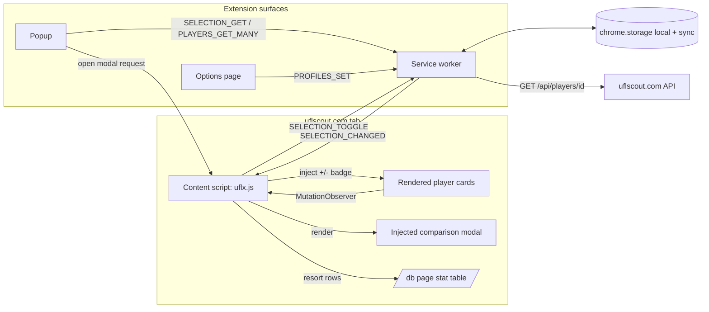

# Requirements

### Overview & Goals

Build a **Chrome Extension (Manifest V3)** that augments `https://uflscout.com/` with player-comparison tooling the site itself does not offer: a persistent multi-player selection list, sorting/filtering by the **sum of the user-relevant stats** (not just overall rating), and reusable **position-based stat profiles** (e.g., a CB profile ignores finishing / freeKicks / penalties).

The extension enhances — not replaces — the site. It reuses the site's own images, promo colours, playstyle icons and card renders wherever possible, so the UI stays visually consistent with UFL Scout.

### Scope

#### In Scope (MVP)

- **Card decoration**: on every rendered player card (anywhere on uflscout.com), inject a small **`+` / `−` toggle** to add/remove the player from a local *Selection List*.
- **Selection List (popup)**: click the extension icon → popup shows selected players, allows removing, clearing, and opening the *Comparison view*.
- **Comparison view**: a rich sortable/filterable table of the selected players. Design recommendation is an **in-site modal injected by the content script** so it inherits the site's CSS, fonts, and card assets — see *Technical Design → Key Decisions* for the trade-off.
- **Stat profiles**: user-editable named profiles (e.g. `CB`, `CM`, `ST`) each being a subset of stat keys. Sorting the comparison table by profile ranks players by the **sum of relevant stats** for that profile.
- **Defaults**: ship sensible seed profiles for CB, FB, CM, CDM, CAM, W, ST, GK so the tool is useful the moment it's installed.
- **In-place `/db` page enhancement**: on `https://uflscout.com/db*`, add a *Sort by profile* control that resorts the site's existing full-DB table by profile sum — no separate table needed.
- **Options page**: create, rename, edit, delete stat profiles; pick the *active* profile.

#### Out of Scope (deferred)

- **Compare-page deep link**: a button that opens `https://uflscout.com/compare?p1=…&p2=…&p3=…` with the top 3 selected players. Design allows for it; implementation is a stretch item.
- Weighted stat profiles (per-stat weights, not just set inclusion) — MVP uses unweighted sums.
- Cross-device sync of the *Selection List* (kept local; only *profiles* sync).
- Any write requests to uflscout.com — the extension is read-only against the site's public API.
- Player-vs-player radar chart / diff visualisations.

### User Stories

1. **As a UFL squad-builder**, I want to see a `+` badge on every player card so I can flag candidates as I browse.
2. **As a UFL squad-builder**, I want to open a popup that lists everyone I've flagged so I can review the shortlist at a glance.
3. **As a UFL squad-builder**, I want to open a rich comparison table for my shortlist so I can rank them by the stats I actually care about.
4. **As a CB-hunter**, I want a saved `CB` profile that ignores finishing/freeKicks/penalties so *sort by profile* actually surfaces the best defenders.
5. **As a UFL squad-builder**, I want the site's own DB page to resort by my profile so I can find good players even before shortlisting them.
6. **As a returning user**, I want my selection list and profiles to persist across sessions, and my profiles to sync across devices.

### Functional Requirements

- **FR-1 — Card detection**: the extension identifies player cards by any anchor whose `href` starts with `/players/{id}/` and extracts the numeric id. This works for search results, browse pages, and any future page that renders cards the same way.
- **FR-2 — Toggle button**: injects a `+` badge into each detected card. When the player is in the selection list, the badge shows `−` instead. Clicking toggles the state, updates storage, and updates the badge everywhere immediately.
- **FR-3 — Selection list persistence**: kept in `chrome.storage.local` under key `selectionList` (array of `{ id, addedAt }`).
- **FR-4 — Stat-data acquisition**: `/api/players/search` does NOT include per-stat values; only `/api/players/{id}` does. On first add, the extension fetches `/api/players/{id}`, caches the response in `chrome.storage.local` under `playerCache[id]` with a TTL (e.g. 14 days).
- **FR-5 — Popup**: shows the selection list (card image + name + rating + position). Has *Remove*, *Clear all*, *Open comparison* actions.
- **FR-6 — Comparison view (in-site modal)**: a table with columns `Player | Rating | Position | <every stat key> | Profile Sum`. Header cells are click-sortable. Filter row for `position`, `promo`, `mastery`. Row action: *Remove from selection*.
- **FR-7 — Stat profiles**: stored under `chrome.storage.sync.profiles` = `{ [id]: { name, statKeys[], isDefault } }`. Active profile id under `chrome.storage.sync.activeProfileId`.
- **FR-8 — Options page**: full CRUD over profiles, a checkbox grid of every discovered stat key, and a *reset to defaults* button.
- **FR-9 — In-place `/db` resort**: on `/db*` pages, add a *Sort by profile* dropdown next to the site's own sort controls; on change, resort the visible table rows by profile sum. Requires per-player stats — read from the row cells first, fall back to cached/fetched `/api/players/{id}` for any missing stats.

### Non-Functional Requirements

- **Compatibility**: Chrome 120+ (MV3 with promise-returning `chrome.*` APIs).
- **Performance**: DOM decoration must not stall the page — MutationObserver batching, `requestAnimationFrame`, and per-node idempotence (no double-decoration).
- **Politeness to the site**: cache aggressively; never fetch a player's `/api/players/{id}` more than once per TTL window; no bulk scraping of the entire DB.
- **Privacy**: no data leaves the browser. No analytics, no third-party requests. Only host = `uflscout.com`.
- **Robustness**: the site is an SPA — content script must survive client-side navigations (re-run detection on `history.pushState`/`popstate`, or via observing new nodes).

# Technical Design

### Current Implementation

Greenfield project. Only `.junie/` and `.agents/` configuration folders exist. No manifest, no source, no build tooling.

Target site is an SPA. Signals gathered from the issue description:

- Tailwind utility classes with the `scout-*` design tokens (`text-scout-text`, `bg-scout-*`, etc.).
- Search-results LI contains: card image (`https://cdn.uflscout.com/static-cards/{id}-{hash}.png`), name, promo pill, nationality flag, league icon, and a colour-coded rating number.
- **Anchor pattern**: every player card is an `<a href="/players/{id}/{slug}/…">`. This is the single most reliable selector for the extension.
- **APIs observed**:
    - `GET /api/players/search?search=<q>&limit=<n>` — typeahead search, returns limited card metadata **without stat numerics**.
    - `GET /api/players/{id}` — full player info (assumed to contain per-stat values like `stamina`, `shooting`, `speed`, `acceleration`, `curve`, `finishing`, `freeKicks`, `penalties`, …). The exact stat-key list needs a live probe once the extension is loaded — see *Risks*.
    - `/db?minRating=94` — HTML DB page with a stats table (headers `Player | Tier | RATING | HEIGHT | PAC/DIV | SHO/HAN | PAS/KIC | DRB/REF | DEF/SPE | FIT/POS`).

### Key Decisions (brainstorm surface — push back here)

> These are the choices that shape the whole extension. Each lists the recommendation, the rationale, and the alternatives you asked me to consider.

#### KD-1: Where does the *comparison view* live?

- **Recommendation → In-site injected modal (content-script overlay) + a slim popup for the selection list.**
- **Rationale**: matches your instinct — reuses the site's images (already CDN-cached), promo accent colours, playstyle icons, league flags, fonts, and the whole `scout-*` design system. It also lives at `uflscout.com`, so the user's back button just closes the modal instead of switching tabs. The popup is kept minimal (a list + one *Open comparison* button) so the rich table has real screen width.
- **Alt A: Full extension-owned new tab** (`chrome-extension://…/comparison.html`) — clean, fully controllable, but we lose free access to card renders (the beautiful `static-cards/{id}-<hash>.png` images) unless we hard-code CDN URLs, and it feels like a different product.
- **Alt B: Side panel** — persistent, resizable, good for a sticky selection sidebar, but too cramped for a wide sortable table.
- **Alt C: Hybrid** = popup + side panel for the list + new-tab for the table. Powerful but three surfaces to build; overkill for MVP.

#### KD-2: How do we obtain per-stat numeric values?

- **Recommendation → Lazy fetch `/api/players/{id}` on first add + cache in `chrome.storage.local` with TTL.**
- **Rationale**: search API omits stats, so we can't get them from card-render alone. Fetching once per player and caching (bounded LRU, ~500 entries, 14-day TTL) is invisible to the user and polite to the site. On `/db` pages we opportunistically read stats out of the visible table rows to warm the cache without extra requests.
- **Alt A: Bulk prefetch the entire DB** — either by scraping `/db` HTML pages or by discovering a bulk API. Fast to sort *everything*, but heavy, brittle if the site tweaks its DOM, and possibly against the site's expectations.
- **Alt B: Never fetch — only ever use rendered DOM** — fails as soon as the user selects a card from search results (no stat cells rendered there).

#### KD-3: How do we detect player cards inside a React/SPA?

- **Recommendation → `MutationObserver` on `document.body` looking for `a[href^="/players/"]:not([data-uflx-decorated])`, batched with `requestAnimationFrame`.**
- **Rationale**: the anchor selector is stable and semantic. `:not([data-uflx-decorated])` makes decoration idempotent. rAF batching honours the skill's mandatory DOM-batch rule (`content-scripts.md` #6).
- **Also handle**: SPA navigations via `history.pushState`/`popstate` and `chrome.webNavigation.onHistoryStateUpdated` for a hard-refresh trigger.

#### KD-4: Should sorting also happen *in place* on the site's own pages?

- **Recommendation → Yes, on `/db*`.** The site already has the stat cells rendered — resorting is pure client-side math. Adds enormous value with almost no extra code.
- **Trade-off**: we accept that our resort is only over the currently-loaded page of results (site paginates). Adequate for MVP; a future stage can wire it to the site's own pagination controls.

#### KD-5: Where do we store what?

 Data | Area | Why |
---|---|---|
 Selection list (`selectionList`) | `chrome.storage.local` | Per-device shortlist; can be large; no need to sync. |
 Player cache (`playerCache`) | `chrome.storage.local` | Bounded LRU, up to ~1 MB. Sync quota would explode. |
 Stat profiles (`profiles`, `activeProfileId`) | `chrome.storage.sync` | Small (dozens of KB), user wants them on any machine. |
 Ephemeral UI state | in-memory + `chrome.storage.session` where needed | Modal open state, last-sorted column, etc. |

#### KD-6: What's the extension's action-icon behaviour?

- **Recommendation → Standard popup** (`"action": { "default_popup": "popup/popup.html" }`). Popup lists the selection and hosts the *Open comparison* button. No side panel.
- Rationale: matches your original spec ("when I click the extension icon again"), keeps the mental model simple, and side-steps `activeTab`-from-side-panel gotchas from the skill.

### Proposed Changes

**New extension** with three runtime surfaces:

1. **Content script** (`content/uflx.js` + `content/uflx.css`), matched on `https://uflscout.com/*`.
    - Detects player-card anchors, injects the `+ / −` toggle, and hosts the injected *comparison modal* and the `/db` *sort-by-profile* control.
    - Communicates with the service worker via `chrome.runtime.sendMessage` for selection reads/writes and stat fetches.
2. **Service worker** (`background/sw.js`) — the data layer.
    - Owns storage reads/writes, the `/api/players/{id}` fetch queue, per-player cache TTL logic, LRU eviction, and broadcasts `selection-changed` events to all uflscout.com tabs so every open tab redecorates simultaneously.
3. **Extension pages**
    - `popup/popup.html` — selection list, quick actions, *Open comparison* button.
    - `options/options.html` — profile CRUD, active-profile picker.

### Data Models / Contracts

```ts
// chrome.storage.local
type SelectionEntry = { id: number; addedAt: number };
type SelectionList = SelectionEntry[]; // key: 'selectionList'

type CachedPlayer = {
  fetchedAt: number;      // ms epoch
  data: PlayerFullInfo;   // raw /api/players/{id} response
};
type PlayerCache = Record<number, CachedPlayer>; // key: 'playerCache'

// chrome.storage.sync
type StatKey = string;   // e.g. 'stamina', 'shooting', 'finishing', ...
type Profile = {
  id: string;            // uuid or slug like 'cb', 'st'
  name: string;          // 'Center Back'
  statKeys: StatKey[];   // stats included in the sum
  isDefault?: boolean;   // seeded, not user-created
};
type ProfilesState = { profiles: Record<string, Profile>; activeProfileId: string };
```

**Message protocol (content ↔ service worker)**:

```ts
// Selection
{ type: 'SELECTION_GET' }                                → { list: SelectionList }
{ type: 'SELECTION_TOGGLE', playerId: number }           → { inList: boolean }
{ type: 'SELECTION_CLEAR' }                              → { ok: true }

// Player data
{ type: 'PLAYER_GET', playerId: number }                 → { player: PlayerFullInfo }
{ type: 'PLAYERS_GET_MANY', playerIds: number[] }        → { players: PlayerFullInfo[] }

// Profiles
{ type: 'PROFILES_GET' }                                 → ProfilesState

// Broadcast (service worker → all uflscout.com tabs)
{ type: 'SELECTION_CHANGED', list: SelectionList }
{ type: 'PROFILE_CHANGED', activeProfileId: string }
```

### Components

- **`CardDecorator`** (content script) — the MutationObserver + toggle-badge injector. Namespaced CSS class `uflx-toggle`, marker attribute `data-uflx-decorated="1"`.
- **`ComparisonModal`** (content script) — full-screen overlay `<div id="uflx-modal-root">` inserted at the end of `<body>`. Uses site's classes (`bg-scout-*`) where possible and its own scoped classes elsewhere. Sortable table + filter row + per-row remove button.
- **`DbPageResorter`** (content script, `/db*` only) — reads the existing table rows, extracts stat cells, adds a *Sort by profile* dropdown, re-orders `<tr>` nodes client-side.
- **`SelectionPopup`** (`popup/`) — reads selection + player cache, renders each row using the same CDN card image URL pattern.
- **`ProfilesEditor`** (`options/`) — CRUD form, seeds defaults on first install.
- **`PlayerDataService`** (service worker) — fetch queue with de-dup and TTL: `getPlayer(id)`, `warmMany(ids)`, `evictOldest()`.
- **`SelectionService`** (service worker) — thin wrapper over `chrome.storage.local` with a `broadcast()` to open uflscout.com tabs.

### File Structure

```
/manifest.json
/background/
  sw.js
  playerDataService.js
  selectionService.js
  profilesService.js
/content/
  uflx.js               # entrypoint: CardDecorator + boot
  uflx.css              # scoped .uflx-* styles
  cardDecorator.js
  comparisonModal.js
  dbPageResorter.js
  statMath.js           # profile-sum, sort helpers (shared with popup/options)
/popup/
  popup.html
  popup.js
  popup.css
/options/
  options.html
  options.js
  options.css
/shared/
  storageKeys.js
  defaultProfiles.js    # seeded CB / FB / CM / … profiles
  messages.js           # message-type constants
/icons/                 # 16, 48, 128 — real PNGs (skill mandatory rule #1)
CHROMEWEBSTORE.md       # created only if publishing is requested later
```

### Architecture Diagram



### Risks

- **Unknown stat-key list**: the exact JSON shape of `/api/players/{id}` is not in hand. First implementation task is a live probe (via Chrome DevTools for agents) to snapshot one response and derive `StatKey[]`. If the API returns a nested object, the profile UI reflects that shape.
- **SPA route churn**: after a client-side navigation, the previously-decorated DOM may unmount. MutationObserver + re-checking on `history` events mitigates.
- **CSS bleeding into the site**: all injected CSS lives under `.uflx-*` classes and, for the modal, under `#uflx-modal-root`. No global selectors.
- **Fetch de-duplication**: user rapidly toggling `+` should not fire multiple simultaneous `/api/players/{id}` requests — service worker keeps an in-flight map.
- **Storage growth**: `playerCache` needs an LRU cap (e.g. 500 entries) to stay well under the 10 MB local quota.
- **Site DOM changes**: the `href^="/players/"` selector is semantic and unlikely to change, but the injection point (where the badge sits) may. Content script uses a safe fallback: if the preferred host element isn't found, prepend the badge to the anchor itself.
- **Icon assets**: skill rule #1 — every icon referenced must exist. Ship real PNGs for 16 / 48 / 128 or omit the field entirely for the first build.

# Testing

### Validation Approach

With **Chrome DevTools for agents** available, validation is interactive: load the unpacked extension, open `https://uflscout.com/`, and drive real flows while inspecting DOM, storage, and network.

### Key Scenarios

1. **Card detection & idempotence**
    - Load `https://uflscout.com/`, type `valverde` in the site's search box → 8 result LIs appear, each with a `+` badge and no duplicate badges after repeated searches.
    - Every card exposes `[data-uflx-decorated="1"]`.
2. **Toggle + persistence**
    - Click `+` on 3 different players → badges flip to `−`, `chrome.storage.local.selectionList.length === 3`.
    - Reload the page → badges remain `−` for those 3 players.
    - Click one `−` → badge flips back, storage length becomes 2.
3. **Popup**
    - Click the extension icon → popup lists the 2 selected players with card image + rating + position.
    - *Remove* on a row updates the popup **and** any open uflscout.com tab (via `SELECTION_CHANGED` broadcast).
4. **Comparison modal**
    - *Open comparison* → in-site modal opens, one row per selected player, all stat columns present, profile-sum column shown.
    - Click a stat header → rows resort. Click *Profile Sum* header → sort by profile sum descending.
    - Position filter shrinks the row set correctly.
5. **Stat profile**
    - Options page → create profile `CB` with `defence`, `heading`, `interceptions`, `stamina`, `speed` (whichever keys are real).
    - Activate `CB` → profile-sum column in modal recomputes; popup badge updates (if we show one).
6. **In-place `/db` resort**
    - Navigate to `/db?minRating=94` → *Sort by profile* dropdown appears next to native sort controls.
    - Select `CB` → table rows reorder client-side. Native site sort still works when clicked.
7. **Cache correctness**
    - First `+` on a player triggers one network request to `/api/players/{id}` (visible in DevTools Network).
    - Second `+`/`−` on the same player triggers zero requests.

### Edge Cases

- Rapid double-click on `+` toggle → exactly one storage write, no duplicated selection entry.
- Toggling from search-results LI (no stat cells) vs. from `/db` row (has stat cells) both result in a complete cached player.
- SPA navigation: click into a player's detail page then back → badges reappear on the search results without a full reload.
- Comparison modal opened with an empty selection → shows an empty state, not a broken table.
- Profile whose `statKeys` array is empty → sum is 0 for all players (no divide-by-zero, no crash).
- Cache LRU: seed 501 players → oldest one is evicted, others remain.
- Extension update: `chrome.runtime.onInstalled` `"update"` → seed defaults if missing, don't overwrite user edits.

### Test Changes

Automated tests are minimal for an MV3 extension of this size — the harness is Chrome itself. Unit-testable pieces:

- `shared/statMath.js` (`profileSum`, `sortByColumn`) — a small Node/Jest suite is worth it because sorting math is easy to regress.
- `background/playerDataService.js` — a mocked-fetch smoke test for TTL + LRU behaviour.

Everything else is validated interactively with Chrome DevTools for agents against the live site.

# Delivery Steps

###   Step 1: Extension scaffold, manifest, storage schema and icons
A loadable Manifest V3 extension with the correct permissions, host scope, popup + options wiring, and empty content-script/service-worker entrypoints in place.

- Create `manifest.json` (MV3) with:
    - `"host_permissions": ["https://uflscout.com/*"]` (scoped, not `<all_urls>`).
    - `"permissions": ["storage", "scripting", "tabs", "webNavigation"]`.
    - `"action": { "default_popup": "popup/popup.html" }` and `"options_page": "options/options.html"`.
    - `"background": { "service_worker": "background/sw.js", "type": "module" }`.
    - `"content_scripts": [{ matches: ["https://uflscout.com/*"], js: ["content/uflx.js"], css: ["content/uflx.css"], run_at: "document_idle" }]`.
- Generate real PNG icons at `icons/icon-16.png`, `icons/icon-48.png`, `icons/icon-128.png` — or omit the `"icons"` field per skill rule #1 for the first iteration.
- Add `shared/storageKeys.js` (`SELECTION_LIST`, `PLAYER_CACHE`, `PROFILES`, `ACTIVE_PROFILE_ID`) and `shared/messages.js` (message-type constants).
- Implement `background/sw.js` boot: install `runtime.onInstalled` handler that seeds `shared/defaultProfiles.js` (CB, FB, CM, CDM, CAM, W, ST, GK) into `chrome.storage.sync` on `"install"` reason and repairs missing keys on `"update"`.
- Empty but functional `popup/popup.html` + `popup.js` that render "0 selected" so we can verify the icon click works end-to-end.

###   Step 2: Content script — detect player cards and inject the +/- toggle badge
Every player card on any uflscout.com page shows a `+` badge that toggles to `−` when the player is in the selection list; the toggle persists across reloads.

- Implement `content/cardDecorator.js`:
    - `MutationObserver` on `document.body` scanning for `a[href^="/players/"]:not([data-uflx-decorated])`.
    - Batch decoration with `requestAnimationFrame` (skill rule #6).
    - Parse the numeric `playerId` from `href` regex `/^\/players\/(\d+)/`.
    - Inject a `<button class="uflx-toggle">` badge; mark host node with `data-uflx-decorated="1"`.
    - Style with scoped `content/uflx.css` (namespaced `.uflx-*` classes only, no global selectors).
- Wire click handler → `chrome.runtime.sendMessage({ type: 'SELECTION_TOGGLE', playerId })`.
- Implement `background/selectionService.js` with `toggle(id)`, `get()`, `clear()`, and a `broadcast()` helper that pushes `SELECTION_CHANGED` to every uflscout.com tab via `chrome.tabs.query` + `tabs.sendMessage`.
- In the content script, listen for `SELECTION_CHANGED` and re-render every visible `.uflx-toggle` (`+` ⇄ `−`) synchronously.
- Handle SPA route changes: hook `chrome.webNavigation.onHistoryStateUpdated` in the service worker → send a `RESCAN` ping to the tab; content script re-runs the observer sweep.

###   Step 3: Player-stats data layer and selection popup UI
First-time `+` on a player fetches `/api/players/{id}` and caches it; the popup lists selected players with cached data and quick actions.

- Implement `background/playerDataService.js`:
    - `getPlayer(id)` — return cache if fresh (TTL, e.g. 14 days), otherwise `fetch('https://uflscout.com/api/players/' + id)`, store in `chrome.storage.local.playerCache`.
    - In-flight de-duplication map so rapid re-toggles don't fan out into multiple fetches.
    - LRU eviction to keep `Object.keys(playerCache).length` ≤ 500.
    - Error handling per skill's `api-calling.md`: network error → return null, don't throw across the message boundary.
- Extend `SELECTION_TOGGLE` handler to warm the cache: after add, kick off `getPlayer(id)` without blocking the response.
- Build `popup/popup.html` + `popup.js`:
    - On open, `SELECTION_GET` + `PLAYERS_GET_MANY` for its ids.
    - Render rows using `https://cdn.uflscout.com/static-cards/{id}-...png` when known (from the cache), name, rating, position.
    - Actions: *Remove row*, *Clear all*, *Open comparison* (dispatches a message to the active uflscout.com tab; see next stage).
    - Show "You have no uflscout.com tab open — open one to compare" when no tab matches.
    - Update popup live via `chrome.storage.onChanged` listener.

###   Step 4: Options page — default and custom stat profiles per position
Users can create, rename, delete, and activate stat profiles; sensible defaults ship on install.

- Populate `shared/defaultProfiles.js` with seed profiles keyed on real stat keys discovered via a live probe of `/api/players/{id}` at implementation time. Structure per profile: `{ id, name, statKeys[], isDefault: true }`.
- Build `options/options.html` + `options.js`:
    - Left column: list of profiles with *rename* / *delete* / *activate* buttons; *New profile* button.
    - Right column: for the selected profile, a **checkbox grid of every discovered stat key** grouped by category (Physical / Attacking / Passing / Defending / GK).
    - *Reset to defaults* button (only resets seeded profiles, preserves user-created ones).
- Store on every change: `chrome.storage.sync.set({ profiles, activeProfileId })`.
- Handle sync quota: warn if `JSON.stringify(profiles).length > 90_000` (headroom under 100 KB).
- Broadcast `PROFILE_CHANGED` on activation so open uflscout.com tabs redraw any profile-sensitive UI immediately.

###   Step 5: In-site comparison modal and /db page in-place resort
Clicking *Open comparison* opens a rich, sortable modal on top of uflscout.com; on `/db*` pages the site's own stat table can be resorted by the active profile.

- Implement `content/comparisonModal.js`:
    - Create/attach `<div id="uflx-modal-root">` on demand at the end of `<body>`; ensure exactly one instance.
    - Message from popup: `chrome.tabs.sendMessage(tab.id, { type: 'OPEN_COMPARISON' })`.
    - Table columns: `Player | Rating | Position | Promo | <every stat key from statMath.stableStatOrder> | Profile Sum`.
    - Header cells sort ascending/descending; default sort = *Profile Sum* desc.
    - Filter row above the header for `position`, `promo`, `mastery` (multi-select chips).
    - Row action: *Remove* → sends `SELECTION_TOGGLE` and the row disappears.
    - Close on Esc, on backdrop click, and on route change.
    - All styling scoped under `#uflx-modal-root`; reuse card CDN images for the Player cell.
- Implement `content/dbPageResorter.js` (active only when `location.pathname === '/db'`):
    - Detect the site's stats `<table>` and parse each `<tr>` into a stat dict from the header labels (`PAC/DIV | SHO/HAN | PAS/KIC | DRB/REF | DEF/SPE | FIT/POS`).
    - Inject a *Sort by profile* `<select>` near the site's native sort control.
    - On change: compute `profileSum` per row using the active profile's `statKeys` (falling back to a cached `/api/players/{id}` fetch for stats missing from the DOM), then reorder `<tr>` nodes in place.
    - Rebind when the site swaps in a new table (pagination, filter change) via a scoped MutationObserver.
- Implement `content/statMath.js` (shared with popup/options): `profileSum(player, statKeys) → number`, `sortByColumn(rows, key, dir)`, `stableStatOrder(sampleStatDict)` — with a minimal Jest suite as noted in the Testing tab.
